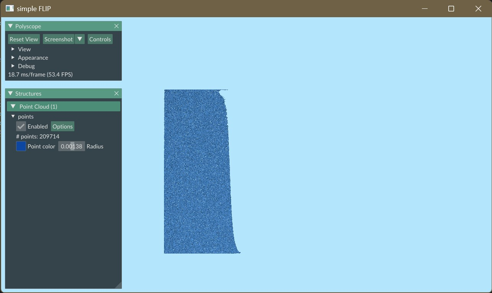
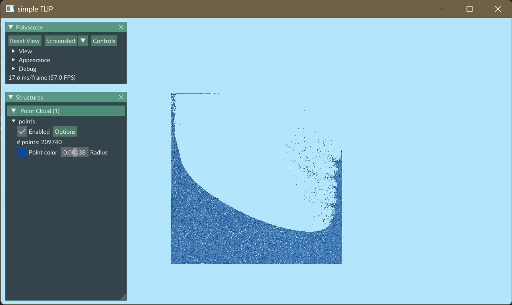
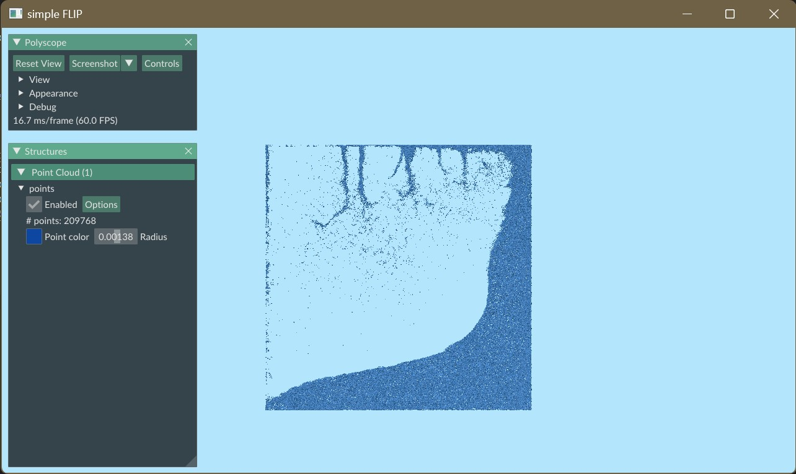
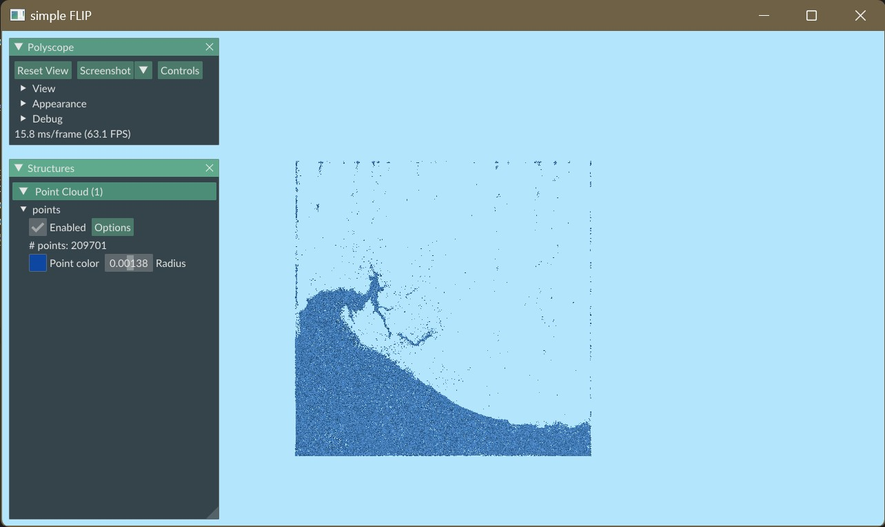

# Simple FLIP

This repo gives a simple implementation for 2D FLIP fluid simulation.

## Configuration

This project is built with xmake ([xmake](https://xmake.io/)). The project is developed with the MSVC compiler of Visual Studio 2019 on Windows 11, although it may also be compatible with other platforms.

You can follow the [offcial tutorial](https://xmake.io/#/guide/installation) to install xmake. Run `xmake` to compile the project. This will automatically install the required package dependencies and compile the project. If you encounter any network problems, I recommend using a proxy. For example, you can set the proxy in Windows PowerShell using the command `$Env:http_proxy="http://127.0.0.1:7890";$Env:https_proxy="http://127.0.0.1:7890"`.

```bash
# compile
xmake
# run
xmake run
```

## Screenshots

<div align=center>


</div>

<div align=center>


</div>
